# Battle City RL: Tabular Q-Learning on a Discrete Grid

This repository contains a course project on **tabular reinforcement learning** in a simplified **Battle City** environment. The main objective is to study whether a **tabular Q-learning agent** can learn an effective control policy in a fully discrete grid-world setting and how its behavior changes as the environment becomes more difficult.

The project starts with a simpler map and then moves to a substantially more challenging third map with denser obstacles and more constrained trajectories. The results show that tabular Q-learning remains effective under increased complexity, although the learned policy becomes robust and defensive rather than fully optimal.

---

## Gameplay Demo

Below is a sample greedy-policy rollout after training. In the repository, it is recommended to place the animation in a dedicated media folder such as `assets/` and reference it from there. 

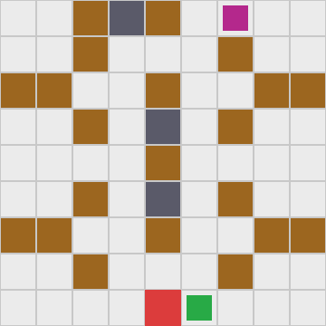

This qualitative example complements the quantitative evaluation. It illustrates that the trained agent is able to preserve the castle, survive, and eliminate the opponent through a cautious but effective sequence of actions.

---

## Project Goal

The goal of this project is to investigate whether a **tabular Q-learning agent** can learn a meaningful and effective policy in a simplified Battle City task represented as a discrete \(9 \times 9\) grid.

The study is designed around two main questions:

1. Can a purely tabular method solve a nontrivial control problem in a tactical grid environment?
2. How does the learned behavior change when moving from an easy map to a harder one?

The emphasis of the project is not on deep reinforcement learning, but on a **clean tabular formulation**, reproducible experiments, and interpretable evaluation metrics.

---

## Environment Formulation

The environment is modeled as a finite Markov decision process

$$
(\mathcal{S}, \mathcal{A}, P, R, \gamma)
$$

where the state is represented as

$$
s_t = (p_{\text{pos}}, p_{\text{dir}}, e_{\text{pos}}, e_{\text{dir}}, b) \in \mathcal{S}.
$$

Here:

- $p_{\text{pos}}$ is the player tank position,
- $p_{\text{dir}}$ is the player tank direction,
- $e_{\text{pos}}$ is the enemy tank position,
- $e_{\text{dir}}$ is the enemy tank direction,
- $b \in \{0,1\}$ indicates whether a player bullet is currently in flight.

The action space is

$$
\mathcal{A} =
\{
\text{noop}, \text{up}, \text{right}, \text{down}, \text{left}, \text{shoot}
\},
\qquad |\mathcal{A}| = 6.
$$

For a $9 \times 9$ grid, the tabular state space size is

$$
|\mathcal{S}| = 81 \cdot 4 \cdot 81 \cdot 4 \cdot 2 = 209{,}952.
$$

The agent optimizes the discounted return

$$
G_t = \sum_{k=0}^{\infty} \gamma^k r_{t+k+1}.
$$

## Learning Algorithm

The project uses **tabular Q-learning** with an $\varepsilon$-greedy exploration strategy.

The Bellman optimality equation for the action-value function is

$$
Q^*(s,a) = \mathbb{E}\left[r + \gamma \max_{a'} Q^*(s',a') \mid s,a\right].
$$

The Q-learning update rule is

$$
Q(s_t,a_t)
\leftarrow
Q(s_t,a_t)
+
\alpha
\Bigl[
r_t + \gamma \max_{a'}Q(s_{t+1},a') - Q(s_t,a_t)
\Bigr].
$$

Exploration is performed using an \(\varepsilon\)-greedy policy, so the agent balances exploitation of learned high-value actions with continued state-space exploration.

---

## Reward Design

The reward structure is intentionally simple and task-oriented:

- **+100** for destroying the enemy,
- **-100** for player death,
- **-200** for castle destruction,
- **-0.1** per time step.

This reward shaping encourages efficient victory, penalizes catastrophic failure, and discourages excessively long episodes.

Episodes terminate when one of the following conditions is met:

- the player is destroyed,
- the enemy is destroyed,
- the castle is destroyed,
- the maximum number of steps is reached.

---

## Evaluation Protocol

To make policy comparison more informative than using return alone, the project includes **reward-independent evaluation**. The following metrics are reported:

- **Win Rate**
- **Survival Rate**
- **Castle Survival Rate**
- **Average Episode Length**
- **Shot Accuracy**
- **Exploration Coverage**
- **Average Score**
- **Average Return**

This evaluation design makes it possible to distinguish between policies that win often, survive often, protect the base well, act efficiently, or simply avoid losing without actively finishing the task.

---

## Baselines

The learned Q-learning agent is compared against the following baselines:

- **Random Policy**  
  A completely uninformed policy that samples actions uniformly at random.

- **Pseudo\_bot\_lag5**  
  A lagged pseudo-agent based on an earlier checkpoint of the learned policy. This baseline is useful because it measures whether the final policy is genuinely better than its own previous versions.

---

## Results on the Third Map

The most important experiment in this repository was conducted on the **third map**, which is substantially more difficult than the first one due to denser obstacles and tighter movement corridors.

The final results were:

| Method | Type | Max Score | Average Score | Average Return | Win Rate | Survival Rate | Castle Survival | Average Episode Length | Average Shots Fired | Shot Accuracy | Exploration Coverage |
|---|---:|---:|---:|---:|---:|---:|---:|---:|---:|---:|---:|
| q_learning | trained_agent | 200.0 | 100.10 | 53.19 | 0.53 | 0.99 | 1.00 | 463.48 | 1.07 | 0.495 | 0.068 |
| pseudo_bot_lag5 | bot_policy | 200.0 | 77.00 | 26.80 | 0.42 | 0.99 | 1.00 | 572.65 | 0.85 | 0.494 | 0.071 |
| random_policy | bot_policy | 270.0 | -76.25 | -66.04 | 0.12 | 0.24 | 0.88 | 137.79 | 22.32 | 0.006 | 0.315 |

---

## Training Diagnostics Gallery

The following plots summarize the learning process. They show that reward improves substantially, while the learned policy becomes more stable and more selective.

### Reward and episode statistics

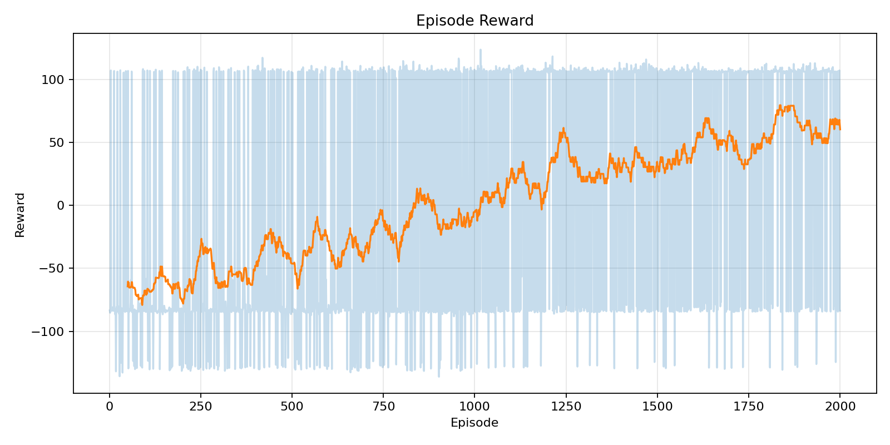
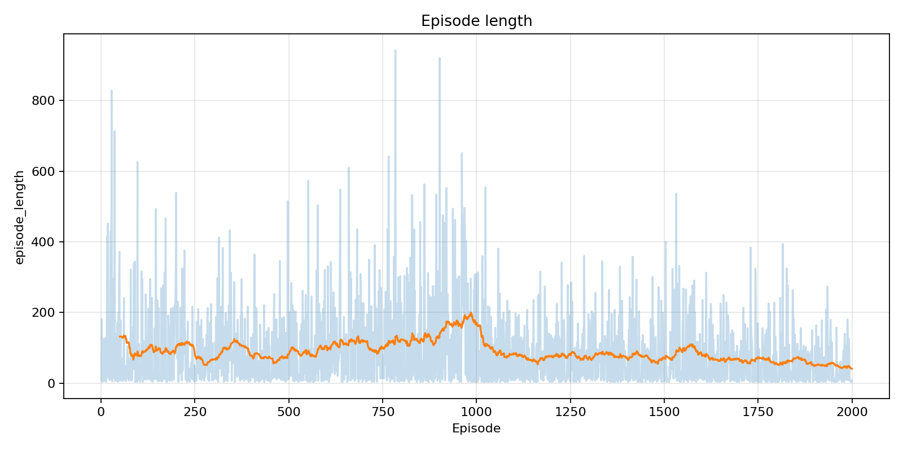
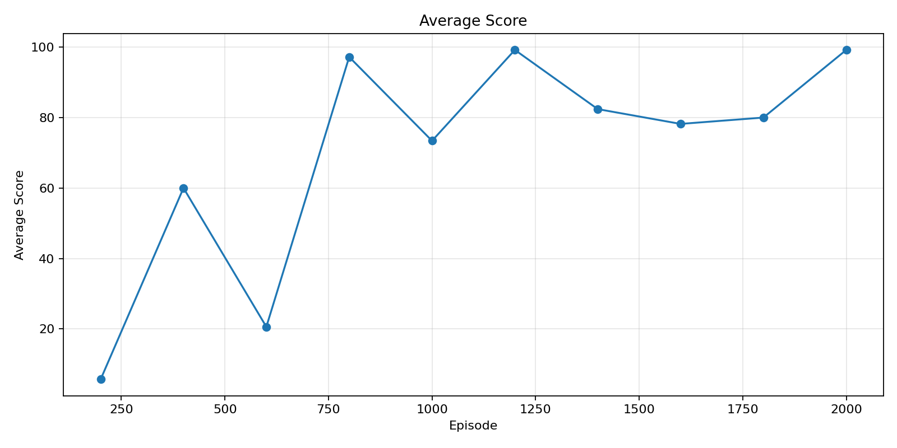

### Temporal-difference learning dynamics

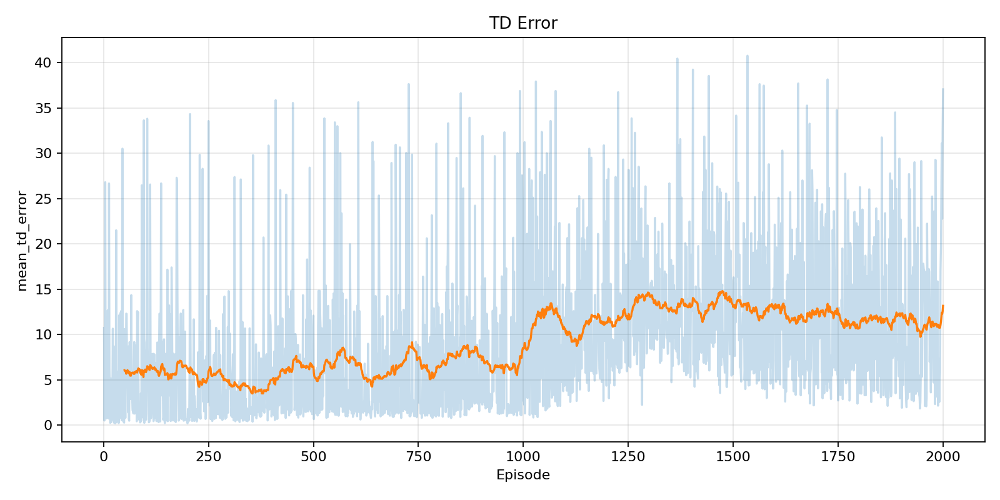
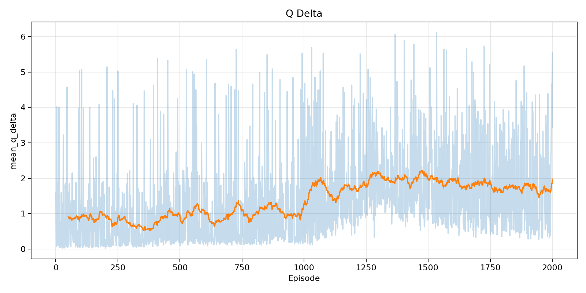
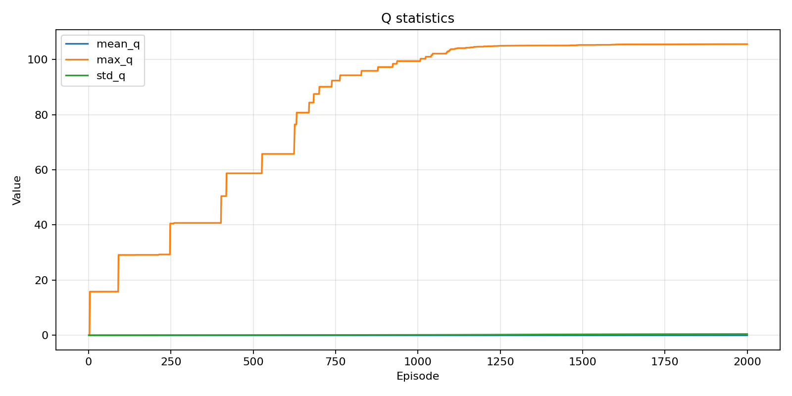

### Exploration diagnostics

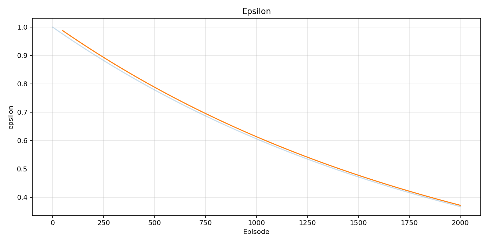
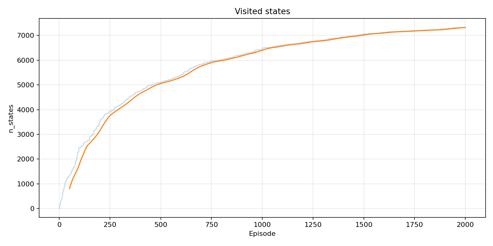
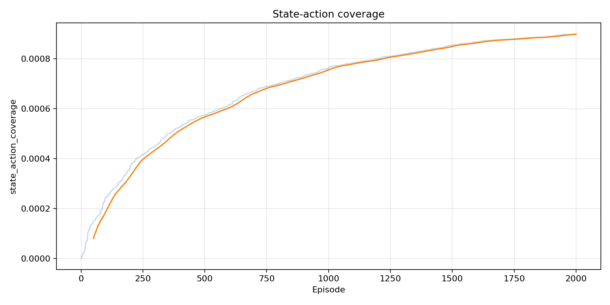

---

## Evaluation Metrics Gallery

These figures illustrate the behavior of the greedy policy during periodic evaluation on the hard map.

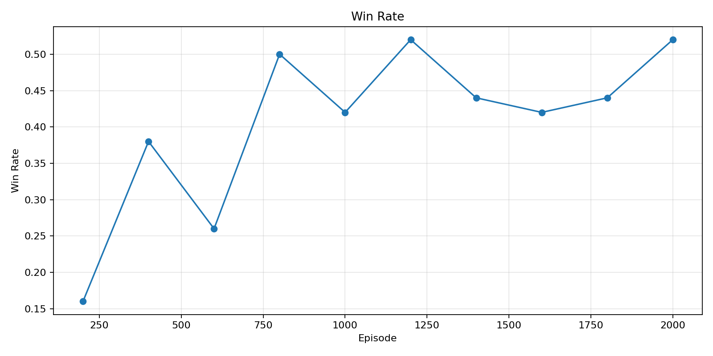
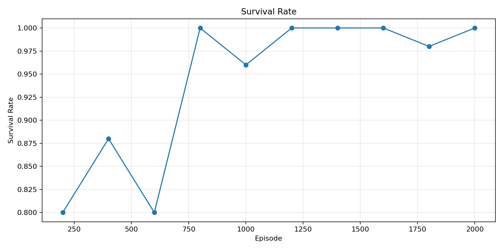
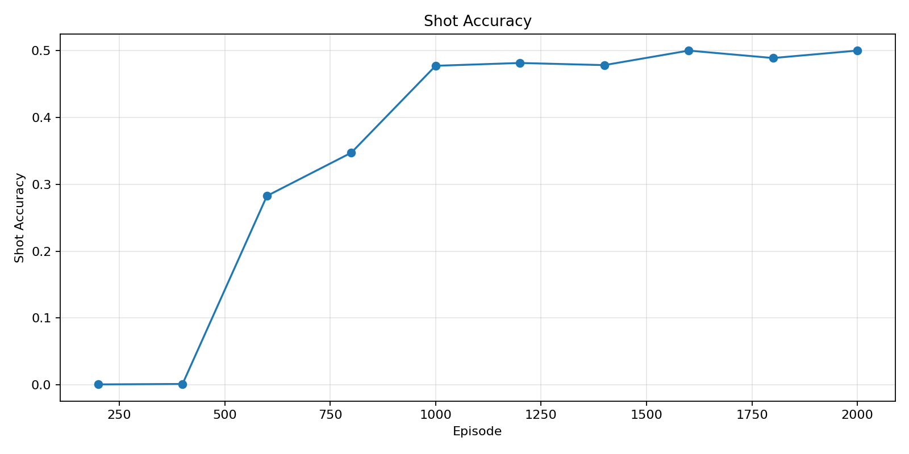
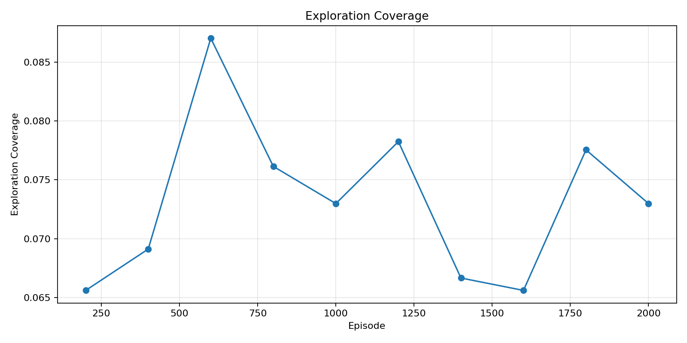

---

## Interpretation of the Results

The experiments on the third map show that **tabular Q-learning does not solve the task perfectly, but it clearly learns a strong and meaningful policy**.

Several conclusions follow from the results.

First, the Q-learning agent is **substantially better than random behavior**. It achieves a much higher win rate, survives almost all episodes, protects the castle perfectly, and acts with dramatically higher shooting precision.

Second, the final policy is also **better than its own earlier checkpoint-based version** (`pseudo_bot_lag5`). This indicates that training continues to produce real improvements rather than simply oscillating around a fixed solution.

Third, the learned policy is best described as **robust, defensive, and conservative** rather than aggressive. This follows from the combination of:

- very high **Survival Rate**,
- perfect **Castle Survival**,
- only moderate **Win Rate**,
- and a very large **Average Episode Length**.

In other words, the agent has learned how to avoid losing, but it has not yet learned how to convert every favorable situation into a fast win.

Finally, the comparison with the random policy reveals one of the most interesting behavioral effects in the project. The trained agent fires on average only about **1 shot per episode**, yet its shot accuracy is close to **0.5**. By contrast, the random baseline fires more than **22 shots per episode** and almost never hits anything. This shows that the learned policy is not based on frequent action spam. Instead, it is selective and waits for favorable tactical states.

---

## Main Findings

The main findings of the project are:

- moving from the first map to the third map substantially increases task difficulty;
- tabular Q-learning remains effective on the harder map;
- the learned agent clearly outperforms weak baselines;
- the policy becomes highly reliable in terms of self-preservation and castle defense;
- however, it remains too conservative to achieve consistently high win rates;
- the third-map results are more realistic and scientifically more informative than the near-perfect performance on the easy map.

---

## Repository Structure

A typical repository structure for this project is:

```text
.
├── README.md
├── train.py
├── evaluate.py
├── agent.py
├── env.py
├── env_adapter.py
├── plots.py
├── render.py
├── 1.txt
├── 2.txt
├── 3.txt
├── artifacts/
│   ├── train_log.csv
│   ├── eval_log.csv
│   ├── q_table.pkl
│   ├── battle_city_results.csv
│   └── *.png / *.gif
└── notebooks/
    └── RL_tanks_fixed_trained_v2_merged_qlearning_bots.ipynb
```

---

## How to Run

### 1. Install dependencies

```bash
pip install -r requirements.txt
```

### 2. Training

```bash
python train.py \
  --level-map-path levels/level_3.txt \
  --episodes 2000 \
  --alpha 0.15 \
  --gamma 0.99 \
  --epsilon 1.0 \
  --epsilon-min 0.05 \
  --epsilon-decay 0.9995 \
  --seed 42 \
  --state-mode tuple \
  --artifacts-dir artifacts
```

### 3. Evaluate the trained agent

```bash
python evaluate.py --q-table artifacts/q_table.pkl --map 3
```

### 4. Render gameplay

```bash
python render.py --q-table artifacts/q_table.pkl --map 3
```

### 5. Generate plots

```bash
python plots.py --train-log artifacts/train_log.csv --eval-log artifacts/eval_log.csv
```

---

## Logged Training Diagnostics

The project tracks multiple training diagnostics to make learning behavior interpretable:

- episode reward,
- TD error,
- Q-value update magnitude,
- mean / max / std of Q-values,
- epsilon,
- visited states,
- state-action coverage,
- episode length.

These diagnostics are helpful for analyzing whether the training process is converging, still exploring, or continuing to substantially modify the value function.

---

## Current Limitations

Although the final policy on the third map is strong, the study also reveals several limitations:

- the policy is not fully optimal;
- episode lengths remain large;
- the win rate is still far from \(1.0\);
- the learned strategy appears more defensive than decisive;
- TD error and Q-delta do not yet indicate full convergence by episode 2000.

These limitations are expected in a difficult environment with a large tabular state space.

---

## Future Work

Several improvements can make the project stronger:

- train on multiple random seeds and report mean \(\pm\) standard deviation;
- add stronger scripted baselines such as attack-oriented and defense-oriented bots;
- refine the reward to encourage faster enemy elimination;
- add penalties for inactivity or excessively long episodes;
- generate GIFs of both successful and failure cases;
- compare behavior across all three maps;
- investigate whether better state abstraction improves the tabular method.

---

## Conclusion

This project demonstrates that **tabular Q-learning is sufficient to learn a nontrivial and tactically competent policy** in a simplified Battle City environment. On the difficult third map, the learned agent does not achieve perfect control, but it becomes highly reliable in survival and base defense while still winning substantially more often than baseline policies.

From a reinforcement learning perspective, this makes the project more convincing rather than less. On the easy map, the method approached near-perfect performance. On the hard map, the method remains clearly effective, but its limitations become visible. As a result, the final outcome provides a realistic and academically meaningful picture of what a tabular RL method can and cannot achieve in a structured tactical environment.
